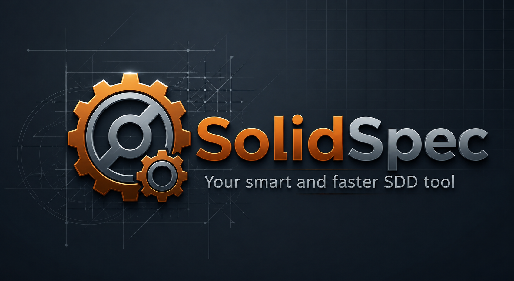

<p align="center">
  
  <p align="center">
    <strong>Specification-Driven Development for the AI era</strong>
  </p>
  <p align="center">
    A Rust CLI that transforms feature descriptions into structured specs, plans, and tasks &mdash; then lets your AI agent build them.
  </p>
  <p align="center">
    <a href="#install">Install</a> &bull;
    <a href="#the-6-step-workflow">Workflow</a> &bull;
    <a href="#using-with-claude-code">Claude Code</a> &bull;
    <a href="#using-with-mistral-vibe">Mistral Vibe</a> &bull;
    <a href="#using-with-github-copilot">Copilot</a> &bull;
    <a href="#use-cases">Use Cases</a> &bull;
    <a href="#all-commands">Commands</a>
  </p>
</p>

---

## The Problem

You describe a feature to your AI coding agent. It generates code. But the code doesn't match what you actually needed &mdash; scope creeps, edge cases are missed, and there's no traceability from requirements to implementation.

**RustySpec fixes this** by inserting a structured specification layer between your idea and the code. Every feature gets a spec, a plan, and a task list &mdash; all versioned in your repo, all driving the AI's implementation.

## The 8-Step Workflow

```
                    You describe a feature
                            |
                            v
  +----------------------------------------------------------+
  |                                                          |
  |   1. rustyspec specify   -->  spec.md                     |
  |   2. rustyspec clarify   -->  clarifications.md           |
  |   3. rustyspec plan      -->  plan.md + research +        |
  |                               data-model + contracts      |
  |   4. rustyspec tasks     -->  tasks.md (phased, parallel) |
  |   5. rustyspec tests     -->  test scaffolds (per story)  |
  |   6. rustyspec implement -->  AI builds from tasks        |
  |   7. rustyspec analyze   -->  consistency report          |
  |   8. rustyspec review    -->  quality review report       |
  |                                                           |
  |   Or run all at once: rustyspec pipeline --new "feature"  |
  |                                                          |
  +----------------------------------------------------------+
                            |
                            v
                  Working, traced code
```

Every artifact references the one before it. Requirements trace to plan sections. Plan sections trace to tasks. Nothing gets lost.

---

## Install

### Build from source

```bash
git clone https://github.com/jyjeanne/rustyspec.git
cd rustyspec
cargo build --release
```

The compiled binary is placed at `target/release/rustyspec` (Linux/macOS) or `target\release\rustyspec.exe` (Windows).

---

### Add to PATH — Linux / macOS

**Option A — copy to a system directory (recommended)**

```bash
sudo cp target/release/rustyspec /usr/local/bin/rustyspec
```

**Option B — add the build output directory to your shell profile**

```bash
# Bash (~/.bashrc or ~/.bash_profile)
echo 'export PATH="$PATH:$HOME/rustyspec/target/release"' >> ~/.bashrc
source ~/.bashrc

# Zsh (~/.zshrc)
echo 'export PATH="$PATH:$HOME/rustyspec/target/release"' >> ~/.zshrc
source ~/.zshrc
```

Replace `$HOME/rustyspec` with the actual path where you cloned the repository.

---

### Add to PATH — Windows

**Option A — copy to a permanent directory, then add it to the system PATH (recommended)**

```powershell
# 1. Create a directory for CLI tools (skip if it already exists)
New-Item -ItemType Directory -Force -Path "$env:USERPROFILE\bin"

# 2. Copy the binary
Copy-Item .\target\release\rustyspec.exe "$env:USERPROFILE\bin\rustyspec.exe"

# 3. Add the directory to the permanent user PATH (takes effect in new shells)
[Environment]::SetEnvironmentVariable(
    "PATH",
    "$env:PATH;$env:USERPROFILE\bin",
    [EnvironmentVariableTarget]::User
)
```

**Option B — add the build output directory to PATH for the current session only**

```powershell
$env:PATH += ";$(Get-Location)\target\release"
```

To make Option B permanent, add it to your PowerShell profile (`$PROFILE`):

```powershell
Add-Content $PROFILE "`n`$env:PATH += `";C:\path\to\rustyspec\target\release`""
```

---

**Verify the installation:**

```bash
rustyspec --version
# rustyspec 0.1.0
```

---

## Quick Start (5 minutes)

### 1. Initialize your project

```bash
mkdir my-app && cd my-app

# Create .claude/ or .vibe/ or .github/ directory for your agent
mkdir .claude

# Initialize RustySpec (auto-detects your AI agent)
rustyspec init --here
```

RustySpec creates:
- `.rustyspec/` &mdash; constitution, templates, config
- `specs/` &mdash; where feature artifacts live
- `rustyspec.toml` &mdash; project configuration
- `.claude/commands/rustyspec-*.md` &mdash; 9 slash commands for your agent

### 2. Describe your feature

```bash
rustyspec specify "TODO list with CRUD operations and local storage"
```

This creates `specs/001-todo-list-crud/spec.md` with:
- Prioritized user stories (P1, P2, P3)
- Functional requirements (FR-001, FR-002...)
- Acceptance scenarios (Given/When/Then)
- Quality checklist

### 3. Plan the architecture

```bash
rustyspec plan 001
```

Generates `plan.md`, `research.md`, `data-model.md`, `quickstart.md`, and `contracts/`.

### 4. Generate tasks

```bash
rustyspec tasks 001
```

Produces a phased task breakdown:

```
Phase 1: Setup
  - [ ] T001 Create project structure
  - [ ] T002 Initialize dependencies

Phase 2: Foundational
  - [ ] T003 Setup data models
  - [ ] T004 [P] Create Task model in src/models/task.rs

Phase 3: User Story 1 - Add a task (P1)
  - [ ] T005 [US1] Implement add task functionality
  - [ ] T006 [P] [US1] Add validation and error handling

Phase 4: User Story 2 - View tasks (P1)
  ...
```

### 5. Let your AI agent build it

Use the slash command in your AI agent:

```
/rustyspec-implement
```

---

## Using with Claude Code

Claude Code gets 9 slash commands automatically registered in `.claude/commands/`.

### Setup

```bash
# Ensure .claude/ exists (Claude Code creates it automatically)
mkdir -p .claude

# Initialize RustySpec
rustyspec init --here
```

You'll see:
```
Registered commands for 1 agent(s): claude
```

### Available slash commands

| Slash Command | What it does |
|---------------|-------------|
| `/rustyspec-specify` | Create a new feature spec from a description |
| `/rustyspec-clarify` | Resolve ambiguities in a spec |
| `/rustyspec-plan` | Generate architecture plan + supporting docs |
| `/rustyspec-tasks` | Generate phased task breakdown |
| `/rustyspec-implement` | Execute tasks from the breakdown |
| `/rustyspec-tests` | Generate and enhance test scaffolds |
| `/rustyspec-analyze` | Validate cross-artifact consistency |
| `/rustyspec-review` | Review spec quality with preflight heuristics |
| `/rustyspec-checklist` | Generate quality validation checklist |

### Step-by-step with Claude Code

**Step 1** &mdash; Open your project in Claude Code and run:

```
/rustyspec-specify Simple TODO app with add, edit, delete, and local storage
```

Claude reads the AGENT.md context, creates a feature branch, and generates `spec.md` with structured user stories, requirements, and acceptance scenarios.

**Step 2** &mdash; Review and refine the spec, then:

```
/rustyspec-plan
```

Claude generates the architecture plan, data model, API contracts, and research document. Constitution gates are checked automatically.

**Step 3** &mdash; Generate tasks:

```
/rustyspec-tasks
```

Claude creates `tasks.md` with phased, parallelizable tasks linked to user stories.

**Step 4** &mdash; Build it:

```
/rustyspec-implement
```

Claude reads the task list and implements each task in order, respecting dependencies and `[P]` parallel markers. Completed tasks are marked `[X]`.

**Step 5** &mdash; Validate:

```
/rustyspec-analyze
```

Claude checks that all requirements trace to plan sections, all plan sections trace to tasks, and the constitution is respected.

---

## Using with Mistral Vibe

Mistral Vibe gets 9 skills registered as directories in `.vibe/skills/`. Each skill has a `SKILL.md` with the `user-invocable: true` frontmatter so it appears in Vibe's slash command list.

### Setup

```bash
mkdir -p .vibe
rustyspec init --here
```

You'll see:
```
Registered commands for 1 agent(s): vibe
```

Skills are created at:
```
.vibe/skills/
  rustyspec-specify/SKILL.md
  rustyspec-clarify/SKILL.md
  rustyspec-plan/SKILL.md
  rustyspec-tasks/SKILL.md
  rustyspec-implement/SKILL.md
  rustyspec-tests/SKILL.md
  rustyspec-analyze/SKILL.md
  rustyspec-review/SKILL.md
  rustyspec-checklist/SKILL.md
```

### Step-by-step with Mistral Vibe

**Step 1** &mdash; In Vibe, run:

```
/rustyspec-specify Real-time chat with message history and user presence
```

Vibe generates a structured spec with prioritized user stories and quality checklist.

**Step 2** &mdash; Generate the plan:

```
/rustyspec-plan
```

Vibe creates the architecture plan with constitution compliance checks, data model, and API contracts.

**Step 3** &mdash; Break it into tasks:

```
/rustyspec-tasks
```

**Step 4** &mdash; Implement:

```
/rustyspec-implement
```

Vibe reads `tasks.md` and builds each task, marking them complete as it goes.

**Step 5** &mdash; Quality check:

```
/rustyspec-analyze
```

---

## Using with GitHub Copilot

Copilot gets `.agent.md` command files in `.github/agents/` with companion `.prompt.md` files in `.github/prompts/`.

### Setup

```bash
mkdir -p .github
rustyspec init --here
```

You'll see:
```
Registered commands for 1 agent(s): copilot
```

### How it works

Copilot commands are registered as:
- `.github/agents/rustyspec-specify.agent.md`
- `.github/agents/rustyspec-plan.agent.md`
- `.github/agents/rustyspec-tasks.agent.md`
- `.github/agents/rustyspec-implement.agent.md`
- etc.

Each also gets a companion `.github/prompts/rustyspec-*.prompt.md`.

### Step-by-step with Copilot

The workflow is the same as Claude Code &mdash; use the slash commands:

```
/rustyspec-specify E-commerce cart with checkout and payment
/rustyspec-plan
/rustyspec-tasks
/rustyspec-implement
/rustyspec-analyze
```

---

## Using Multiple Agents Together

RustySpec registers commands for **all detected agents simultaneously**. If your project has both `.claude/` and `.vibe/`:

```bash
mkdir .claude .vibe
rustyspec init --here
# Registered commands for 2 agent(s): claude, vibe
```

Both agents get the same commands and work from the same spec artifacts. You can:
- Use Claude Code for specification and planning
- Switch to Vibe for implementation
- Use either for analysis
- Or automate everything with `rustyspec pipeline` &mdash; assign agents per phase in `rustyspec.toml`

The artifacts in `specs/` are agent-agnostic &mdash; any agent can read and build from them.

### Automated multi-agent pipeline

```bash
# Configure agent assignments in rustyspec.toml, then:
rustyspec pipeline --new "Todo list REST API" --auto
```

The pipeline invokes each agent's CLI automatically. Claude Code gets `-p` with `--allowedTools`, Vibe gets `-p` (auto-approve). Agents that don't have CLI support fall back to manual handoff.

---

## Use Cases

### Use Case 1: New project from scratch

You're starting a brand new project and want structured, AI-driven development from day one.

**Scenario:** You're building a personal finance tracker as a web app.

#### Step 1 &mdash; Create and initialize the project

```bash
mkdir finance-tracker && cd finance-tracker

# Set up your AI agent directory
mkdir .claude    # or .vibe, .github, etc.

# Initialize RustySpec
rustyspec init --here
```

Your project now has:
```
finance-tracker/
  .rustyspec/          # Constitution, templates, config
  .claude/commands/    # 7 slash commands for Claude Code
  specs/               # Empty — ready for features
  rustyspec.toml       # Project config
  .git/                # Git repo with initial commit
```

#### Step 2 &mdash; Specify your first feature

```bash
rustyspec specify "Dashboard showing income, expenses, and monthly balance with charts"
```

RustySpec creates a feature branch `001-dashboard-showing-income-expenses`, generates `spec.md` with user stories, requirements, and a quality checklist. Edit the spec to refine it.

#### Step 3 &mdash; Plan and generate tasks

```bash
rustyspec plan 001
rustyspec tasks 001
```

You now have a full plan (architecture, data model, API contracts) and a phased task list ready for your AI agent.

#### Step 4 &mdash; Build with your AI agent

Open the project in Claude Code (or Vibe, Copilot, etc.) and run:

```
/rustyspec-implement
```

The agent reads the task list and builds each task in order. When done, validate:

```
/rustyspec-analyze
```

#### Step 5 &mdash; Add the next feature

```bash
rustyspec specify "Transaction import from CSV and bank API"
```

RustySpec auto-numbers it `002`, creates a new branch, and the cycle repeats. Each feature is self-contained in its own `specs/002-*` directory.

---

### Use Case 2: Adding RustySpec to an existing project

You have an existing codebase and want to use RustySpec for new features going forward.

**Scenario:** You have a Node.js API that's been running for 6 months. You want to add a notification system using structured SDD.

#### Step 1 &mdash; Initialize RustySpec in your existing repo

```bash
cd ~/projects/my-existing-api

# Create your AI agent directory if it doesn't exist
mkdir -p .claude

# Initialize RustySpec without overwriting anything
rustyspec init --here
```

RustySpec adds its own directories (`.rustyspec/`, `specs/`) without touching your existing code. Your `.gitignore`, `package.json`, `src/`, etc. are untouched.

```
my-existing-api/
  src/                 # Your existing code — untouched
  package.json         # Your existing config — untouched
  .rustyspec/          # NEW: RustySpec config + templates
  .claude/commands/    # NEW: 7 slash commands
  specs/               # NEW: empty, ready for features
  rustyspec.toml       # NEW: project config
```

#### Step 2 &mdash; Edit the constitution for your project

The default constitution assumes a greenfield project. For an existing project, edit `.rustyspec/constitution.md` to match your team's actual principles:

```bash
# Open and customize
$EDITOR .rustyspec/constitution.md
```

For example, you might:
- Change "Library-First" to match your monorepo structure
- Add your team's testing conventions
- Reference your existing API patterns

#### Step 3 &mdash; Specify the new feature

```bash
rustyspec specify "Real-time notification system with email, push, and in-app channels"
```

RustySpec creates `specs/001-real-time-notification-system/spec.md`. Edit the spec to reference your existing codebase:

- Mention existing models the notification system needs to integrate with
- Reference your existing auth middleware
- Note your current database and message queue setup

#### Step 4 &mdash; Plan with awareness of existing code

```bash
rustyspec plan 001
```

Edit `plan.md` to reference your existing architecture:
- Point to existing services the new feature depends on
- Reference your current test infrastructure
- Note existing patterns to follow

#### Step 5 &mdash; Generate and execute tasks

```bash
rustyspec tasks 001
```

The task list includes a Foundational phase for integration points with your existing code. Use your AI agent:

```
/rustyspec-implement
```

The agent builds the notification system, following the plan that's aware of your existing codebase.

#### Step 6 &mdash; Continue with more features

```bash
rustyspec specify "User preference center for notification settings"
# Auto-numbered as 002, new branch, new spec
```

Each new feature follows the same structured workflow. Old code stays untouched, new features are fully specified and traced.

---

#### Key differences between new and existing projects

| | New project | Existing project |
|---|---|---|
| **Init** | Creates project structure from scratch | Adds `.rustyspec/` and `specs/` alongside existing code |
| **Constitution** | Use defaults | Customize to match your team's existing patterns |
| **Spec writing** | Describe features freely | Reference existing models, APIs, and patterns |
| **Plan** | Greenfield architecture | Integration-aware, references existing services |
| **Tasks** | Full setup from scratch | Foundational phase focuses on integration points |
| **Git** | Clean history from first commit | Feature branches alongside your existing branches |

---

## Multi-Agent Pipeline

Run the entire SDD workflow with one command, using different AI agents per phase. The pipeline **invokes each agent's CLI automatically** to fill spec artifacts with real content &mdash; not just empty templates.

```toml
# rustyspec.toml
[pipeline]
specify = "claude"       # Claude writes specs
plan = "claude"          # Claude for architecture
tasks = "claude"         # Claude for task breakdown
tests = "claude"         # Claude for test generation
implement = "vibe"       # Mistral Vibe for code
analyze = "claude"       # Claude for cross-checking
review = "claude"        # Claude for quality review
```

```bash
# Full pipeline on a new feature (agents invoked automatically)
rustyspec pipeline --new "User auth with OAuth" --auto

# Partial pipeline
rustyspec pipeline 001 --from plan --to tasks

# Preview without executing
rustyspec pipeline 001 --dry-run

# Scaffold only — generate templates without invoking AI agents
rustyspec pipeline --new "Feature name" --no-agent
```

### How it works

The pipeline runs 8 phases in order: **specify → clarify → plan → tasks → tests → implement → analyze → review**.

For each Auto phase (specify, clarify, plan, tasks, tests, analyze):
1. RustySpec generates the template scaffold (spec.md, plan.md, etc.)
2. RustySpec invokes the agent's CLI non-interactively with detailed, phase-specific instructions
3. The agent reads the scaffold and fills it with real content

The `implement` phase is always a **handoff** &mdash; it tells you which agent to open and waits for confirmation.

### Execution modes

The pipeline detects agent CLI availability upfront and reports the mode:

```
Pipeline: 001-todo-api [fully automated]     # All agents have CLI support
Pipeline: 001-todo-api [mixed mode]          # Some need manual handoff
Pipeline: 001-todo-api [scaffold-only]       # --no-agent flag used
```

If an agent's CLI is not installed, the pipeline falls back to handoff mode for that phase (shows the manual command to run).

### Supported agent CLI invocations

| Agent | CLI Binary | Non-interactive Flag |
|-------|-----------|---------------------|
| Claude Code | `claude` | `-p` + `--allowedTools` |
| Mistral Vibe | `vibe` | `-p` (auto-approves tools) |
| Codex CLI | `codex` | `exec` subcommand |
| Copilot CLI | `copilot` | `-p` + `--allow-all-tools` |
| Kimi Code | `kimi` | `--yolo` |
| Cursor | `cursor-agent` | `-n` |
| Aider | `aider` | `-m` |
| Roo Code | `roo-code-cli` | `--headless` |

A `pipeline-log.md` is generated in the feature directory with timestamps, agents, duration, and status per phase.

### Real-world example

A pipeline test with Claude Code (specify/plan/tasks/tests/analyze) + Mistral Vibe (implement) on a "Todo List REST API" produced:

| Phase | Agent | Duration | Output |
|-------|-------|----------|--------|
| specify | Claude | 40s | 5 user stories, 14 acceptance scenarios, 12 FRs |
| plan | Claude | 95s | Node.js + Express + SQLite stack, API contracts |
| tasks | Claude | 75s | 20 tasks across 8 phases with FR references |
| tests | Claude | 88s | 5 test files with concrete assertions |
| implement | Vibe | manual | Full CRUD API, 22 passing integration tests |

Total: ~5 minutes for automated phases, fully working API with tests.

---

## Spec-to-Test Generation

Generate runnable test scaffolds from your spec's acceptance scenarios:

```bash
rustyspec tests 001
# Detected: Jest (JavaScript)
# Parsed: 6 acceptance scenarios from 4 user stories
# Generated: 4 test files
```

Auto-detects your test framework from project files (Jest, Vitest, pytest, cargo test, Go, generic). Each test has Given/When/Then comments and a failing body:

```javascript
describe('US1: Add a new task', () => {
  test('task appears in list with pending status', () => {
    // Given: the app is open
    // When: user types a task title and clicks "Add"
    // Then: the task appears in the list with status "pending"
    throw new Error('TODO: implement this test');
  });
});
```

Override framework with `--framework pytest`, preview with `--dry-run`.

---

## Generated Artifacts

For each feature, RustySpec generates a complete artifact tree:

```
specs/001-todo-list-crud/
  spec.md                  # User stories, requirements, acceptance criteria
  clarifications.md        # Decision log with session dates
  plan.md                  # Architecture plan with constitution gates
  research.md              # Technology investigation
  data-model.md            # Entity definitions and relationships
  quickstart.md            # Key validation scenarios
  contracts/               # API specifications
    api.md
  tasks.md                 # Phased task breakdown
  tests/                   # Test scaffolds from acceptance scenarios
    us1_add_task.test.js
    us2_view_tasks.test.js
  checklists/
    requirements.md        # Quality validation checklist
  pipeline-log.md          # Pipeline execution log (agents, timing, status)
```

All artifacts are Markdown. All are version-controlled. All trace back to the original spec.

---

## Project Constitution

Every RustySpec project gets a `constitution.md` defining architectural principles:

| Gate | What it checks |
|------|---------------|
| **Simplicity** | Max 3 projects, no speculative features |
| **Anti-Abstraction** | Use frameworks directly, no wrapper layers |
| **Integration-First** | Contract tests before implementation, real services over mocks |

The `plan` command evaluates these gates automatically. Violations are reported but don't block &mdash; the plan is generated with warnings so you can decide how to proceed.

---

## Template System

Templates control what gets generated. They follow a 4-layer priority hierarchy:

| Priority | Location | Use case |
|----------|----------|----------|
| 1 (highest) | `.rustyspec/templates/overrides/` | Project-specific tweaks |
| 2 | `.rustyspec/presets/<id>/templates/` | Team workflow presets |
| 3 | `.rustyspec/extensions/<id>/templates/` | Extension templates |
| 4 (lowest) | Embedded in binary | Defaults |

Install a custom preset:

```bash
rustyspec preset add ./my-team-preset --priority 5
```

---

## All Commands

| Command | Description |
|---------|-------------|
| `rustyspec init [name]` | Initialize project with constitution, templates, agent commands |
| `rustyspec specify <desc>` | Create feature spec with user stories and quality checklist |
| `rustyspec clarify [id]` | Resolve `[NEEDS CLARIFICATION]` markers |
| `rustyspec plan [id]` | Generate plan + research + data model + contracts |
| `rustyspec tasks [id]` | Generate phased task breakdown with `[P]` parallel markers |
| `rustyspec implement [id]` | Execute tasks with hook support and `--pass` for iterations |
| `rustyspec tests [id]` | Generate test scaffolds from Given/When/Then scenarios (`--framework`) |
| `rustyspec analyze [id]` | Validate consistency (read-only) with severity levels |
| `rustyspec review [id]` | Review spec quality with preflight heuristics and dimension scoring |
| `rustyspec checklist [id]` | Generate/append quality checklists (`--append`) |
| `rustyspec pipeline [id]` | Run multi-agent SDD pipeline (`--new`, `--from`, `--to`, `--auto`, `--no-agent`) |
| `rustyspec preset <cmd>` | Manage presets (`add`, `remove`, `list`, `search`, `info`) |
| `rustyspec extension <cmd>` | Manage extensions (`add`, `remove`, `enable`, `disable`, `list`) |
| `rustyspec upgrade` | Refresh templates + agent commands after update |
| `rustyspec completions <shell>` | Generate shell completions (bash, zsh, fish, powershell) |
| `rustyspec check` | Verify system prerequisites |

Feature ID is auto-detected from git branch or latest spec if omitted.

---

## Supported AI Agents (20)

| Agent | Directory | Format |
|-------|-----------|--------|
| Claude Code | `.claude/commands/` | Markdown |
| Mistral Vibe | `.vibe/skills/` | Markdown (directory-based) |
| GitHub Copilot | `.github/agents/` | Markdown + `.prompt.md` |
| Gemini CLI | `.gemini/commands/` | TOML |
| Cursor | `.cursor/commands/` | Markdown |
| Windsurf | `.windsurf/workflows/` | Markdown |
| Codex CLI | `.codex/prompts/` | Markdown |
| Kiro CLI | `.kiro/prompts/` | Markdown |
| Kimi Code | `.kimi/skills/` | Markdown (directory-based) |
| Tabnine CLI | `.tabnine/agent/commands/` | TOML |
| Qwen Code | `.qwen/commands/` | Markdown |
| opencode | `.opencode/command/` | Markdown |
| Kilo Code | `.kilocode/workflows/` | Markdown |
| Auggie CLI | `.augment/commands/` | Markdown |
| Roo Code | `.roo/commands/` | Markdown |
| CodeBuddy | `.codebuddy/commands/` | Markdown |
| Qoder CLI | `.qoder/commands/` | Markdown |
| Amp | `.agents/commands/` | Markdown |
| SHAI | `.shai/commands/` | Markdown |
| IBM Bob | `.bob/commands/` | Markdown |

---

## Configuration

### `rustyspec.toml`

```toml
[project]
name = "my_project"
version = "0.1.0"

[ai]
default_agent = "claude"

[git]
auto_branch = true
auto_commit = true
```

### Environment Variables

| Variable | Description |
|----------|-------------|
| `RUSTYSPEC_AI` | Override default AI agent |
| `RUSTYSPEC_FEATURE` | Override feature detection (skip git/scan) |
| `GH_TOKEN` | GitHub API authentication |

---

## Development

```bash
# Run all 278 tests
cargo test

# Build release binary
cargo build --release

# Generate shell completions
rustyspec completions bash > ~/.bash_completion.d/rustyspec
rustyspec completions zsh > ~/.zfunc/_rustyspec
rustyspec completions fish > ~/.config/fish/completions/rustyspec.fish
```

### Architecture

```
src/
  cli/          17 command handlers (clap derive)
  core/         Spec parser, planner, task generator, test generator, pipeline, analyzer, constitution
  agents/       20-agent config table, detection, format translation, registration, CLI invoker
  templates/    Tera rendering + 4-layer resolver
  presets/      Manifest validation, registry, manager
  extensions/   Manifest, registry, hooks, manager
  config/       TOML configuration handling
```

---

## License

[MIT](LICENSE)
